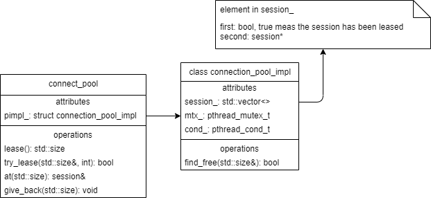

# Introduction
A simple guide about how to use SOCI, since only small amount of references can be found about SOCI.

## Connect Pool
The head file is `connection-pool.h` and its basic class likes below:

### Borrow from the connection pool
To borrow a session from the connection pool, there are two ways:
1. call `std::size_t lease()` to get a session until success
2. call `bool try_lease(std::size_t & pos, int timeout)` to get a session with timeout, 

After get the index of session from `connection_pool_impl::sessions_`, the `session & at(std::size_t pos)` function must be called to get the session.

### Return back to the connection pool
To return back the session to the connection pool, the `void give_back(std::size_t pos)` must be called.

### Optimization
The above interface is not conventient for user, and the better interface likes below:
1. To borrow: `session* lease(int timeout = -1);`
2. To return back: `void give_back(session*);`

Except for that, the connection pool should be designed as a singleton class.

## ODBC

## ORM
